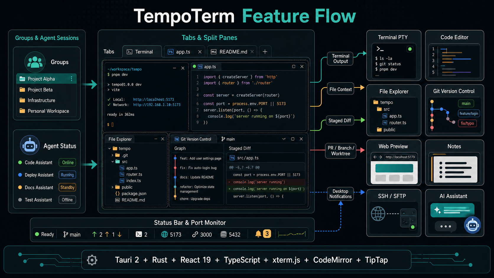

<div align="center">


# TempoTerm



An AI-native terminal workspace that brings the terminal, code editor, file explorer, Git and an AI assistant into a single window, with first-class Traditional Chinese support.

**English** · [正體中文](./README.zh-Hant.md) · [简体中文](./README.zh-Hans.md)

</div>

TempoTerm is a desktop app built on Tauri 2 + Rust and React 19. It pairs a native PTY terminal with a code editor, file explorer, source control, web preview, notes, SSH/SFTP remote access and a bring-your-own-key AI assistant, and ships a full Traditional Chinese interface with CJK-friendly terminal fonts. It organizes your work into named groups, and each tab's card tracks its Claude Code or Codex CLI session status live, alongside the Git branch, worktree and matching pull request. It can also run several worktrees of one repo in parallel, each in its own directory with its own agent.

<div align="center">


</div>

## Highlights

- **An AI agent command center**: each tab's card tracks its Claude Code or Codex CLI session live — status, Git branch, worktree and pull request — split panes each list their own agent, and a desktop notification fires when an agent needs approval
- **Review diffs, reply to your agent**: comment on any diff line and batch-send the feedback straight into a running agent session
- **Parallel worktrees**: run several worktrees of one repo side by side, each in its own directory with its own agent
- **AI Sessions**: browse every past Claude Code, Codex and Antigravity conversation in one place, with an activity dashboard and estimated cost
- **A one-window workspace**: terminal, code editor, file explorer, source control, notes, SSH/SFTP, web preview and image/PDF preview, all freely splittable side by side
- **Bring-your-own-key AI assistant**: OpenAI, Anthropic, Google Gemini, Groq, DeepSeek, Ollama and any OpenAI-compatible endpoint, with keys encrypted and bound to your machine
- **First-class Traditional Chinese**: a fully translated UI and terminal font settings that keep full-width CJK glyphs aligned

## Features

### AI workflow

- Named groups in the sidebar organize your tabs; each card shows a filterable session status (working, thinking, waiting for input or approval), the branch, worktree and matching PR, a split tab lists every pane's own agent, and card titles derive from the session transcript
- A desktop notification fires when a tracked agent needs approval or finishes in the background; the launcher starts Claude Code or Codex CLI directly with default arguments
- Comment on any diff line via the + in its gutter, then send the batch — grouped by file, anchored to lines and code — into a terminal pane running Claude or Codex; the prompt lands in its input box for you to confirm
- Create a worktree from the terminal menu or the commit graph; creation can copy local files such as `.env`, run a remembered setup command and launch an agent right away. A status-bar badge opens the manager listing each worktree's branch, changes, agent activity and disk usage
- AI Sessions reads each CLI's local files directly (nothing is copied into TempoTerm), with an activity heatmap, model usage, per-project stats, cost estimates, and Markdown/CSV export
- The AI assistant panel works with your own keys; attach files from the explorer as context — terminal output is included by default with secrets redacted first


### Terminal & workspace

- xterm.js v6 over a native PTY: in-terminal search, zsh autosuggestions, hover action cards for IPs and archives, and Unicode width tables that keep full-width CJK glyphs aligned
- Any pane splits four ways: click a sidebar item to auto-split, drag a file onto a pane, use the right-click menu, or drop onto the tab bar for a new tab
- CodeMirror 6 editor with AI ghost-text completion (Tab to accept), Markdown edit/split/preview modes, and auto-reload when a file changes on disk
- File tree with fuzzy find and content grep, two-way cd sync with the terminal; click an image or PDF to preview it right in the pane
- One-click native web preview for HTML files (not an iframe, so no embedding restrictions), updating on save
- Terminal and editor headers show a clickable breadcrumb path; sidebar panels dock as icon strips on either side of the window

| **Click to split**<br>Click a file or note in the explorer or notes sidebar; it splits straight into the active tab<br> | **Drag onto a pane**<br>Drag a file or note onto any pane; where you drop it decides the split direction<br> |
| --- | --- |
| **Right-click menu**<br>Open in a new tab, or split into a pane, straight from the right-click menu<br> | **Drag onto the tab bar**<br>Drop a file, note or SSH connection onto the tab bar to open a brand-new tab<br> |

### Everything else

- Source control: stage, commit and push grouped by folder, an AI-generated Conventional Commits message from the staged diff, and a commit graph where any commit shows its changes and diff, with an AI explanation on demand
- SSH: a connections panel that remembers details and key passphrases, local port forwarding, and SFTP browse/edit of remote files in the explorer while connected
- Notes: a WYSIWYG editor with a slash-command menu and code blocks that run in the terminal with one click
- Status bar: live CPU, memory and network, plus a ports panel listing each port's owning process with direct actions
- Multiple windows, each with its own tabs, groups and chat state
- Several dark and light themes; English and Traditional Chinese UI switchable on the fly


## Tech stack

Tauri 2, Rust, portable-pty, git2, keyring, russh, React 19, TypeScript, Vite, Zustand, Tailwind CSS v4, xterm.js v6, CodeMirror 6, TipTap, i18next.

## Development

```bash
pnpm install        # install frontend dependencies
pnpm tauri dev      # run the desktop app in dev mode
pnpm typecheck      # TypeScript type check
pnpm build          # build the frontend
```

## Testing

```bash
pnpm test                       # frontend unit and integration tests (Vitest)
cd src-tauri && cargo test      # backend Rust tests
```

## License

TempoTerm is licensed under the [Apache License 2.0](LICENSE).
The TempoTerm name and logo are not licensed for use by derivative works (see [NOTICE](NOTICE)).

## Support

If TempoTerm saves you time, you can support its continued development. Every contribution helps keep the project moving.

<div align="center">

<a href="https://portaly.cc/mukiwu/support">
  
</a>

</div>
