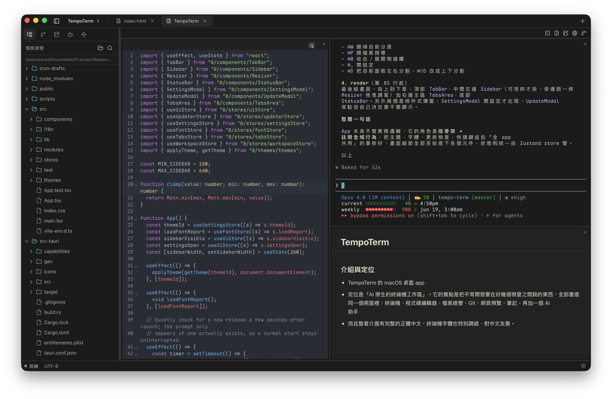
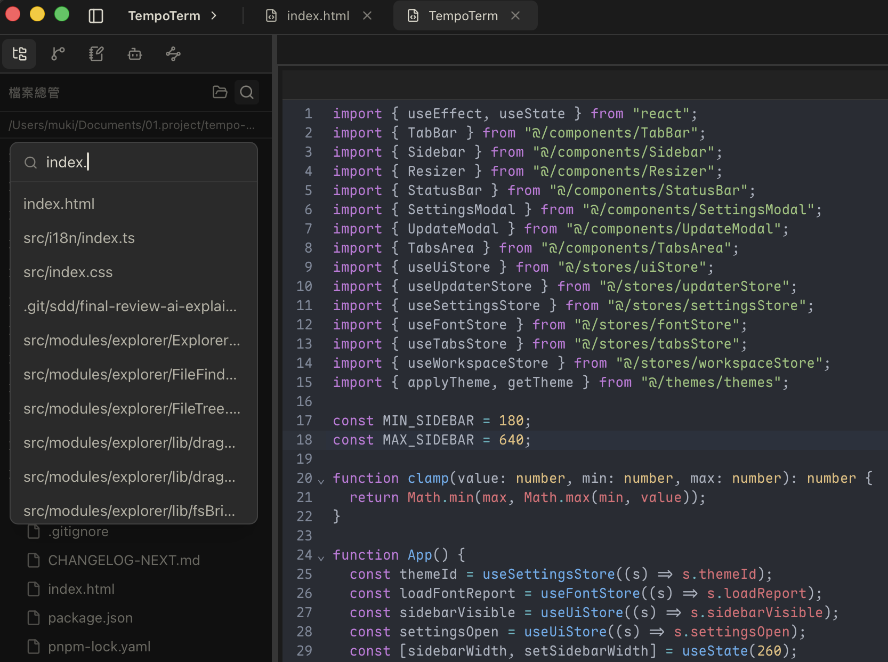
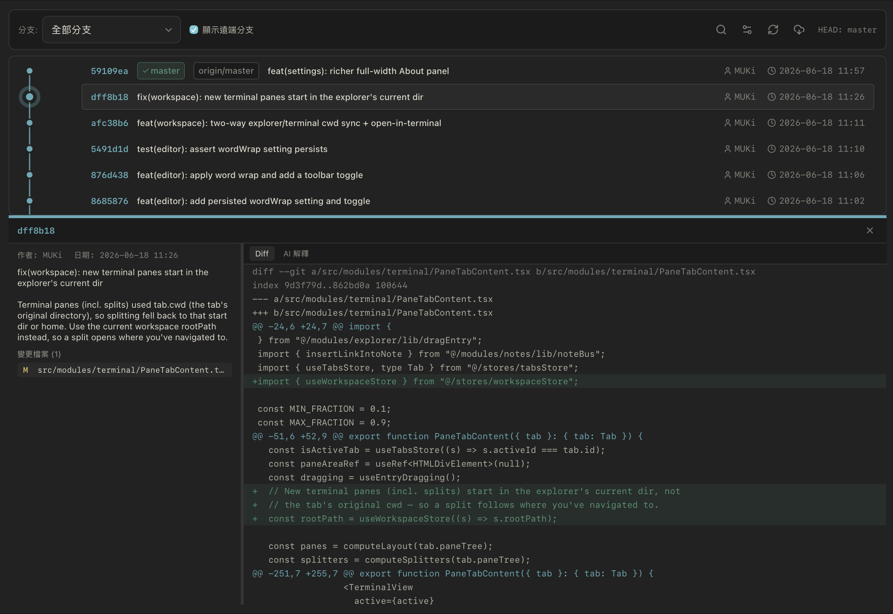
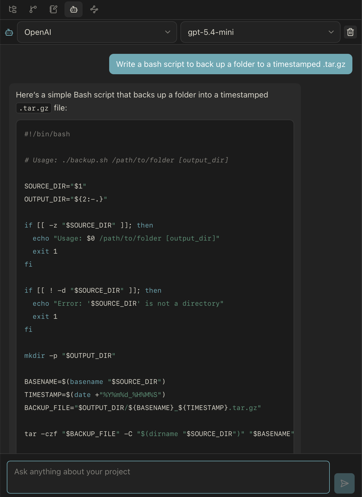
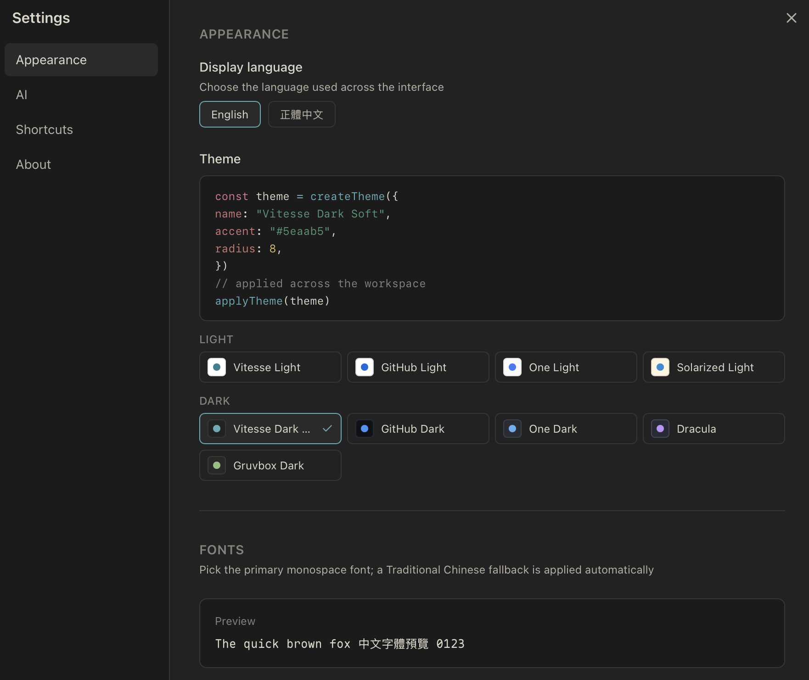

<div align="center">


# TempoTerm

An AI-native terminal workspace that brings the terminal, code editor, file explorer, Git and an AI assistant into a single window, with first-class Traditional Chinese support.

**English** · [正體中文](./README.zh-Hant.md) · [简体中文](./README.zh-Hans.md)

</div>

TempoTerm is a desktop app built on Tauri 2 + Rust and React 19. It pairs a native PTY terminal with a code editor, file explorer, source control, web preview, notes and a bring-your-own-key AI assistant, and ships a full Traditional Chinese interface with CJK-friendly terminal fonts.

<div align="center">



</div>

## Features

### Terminal

- xterm.js v6 over a native PTY (portable-pty), with typed tabs
- Free split layout: panels can mix types, for example a terminal next to a file editor, with draggable dividers to resize
- Alt or Cmd click a file path in the output to open it in a split pane
- Standard editing shortcuts that carry over from other terminals: Shift+Enter, word and line navigation, delete to line start/end, copy and paste
- Unicode 11 width tables so full-width CJK glyphs stay aligned

### Editor

- CodeMirror 6 with syntax highlighting
- Follows the app theme's light or dark appearance
- Markdown files toggle between edit, split and preview

### File explorer

- File tree with fuzzy find and content grep
- Right-click context menu: open, reveal in Finder, new file or folder, copy path, attach to the AI agent, delete to trash
- Drag a file or folder onto any pane, with behavior per pane type



### Source control

- Status, stage, unstage, commit and push
- Git history with a commit graph



### Web preview

- Embedded preview of a URL or a dropped local file

### Notes

- WYSIWYG editor (TipTap) with a slash command menu
- Code blocks with syntax highlighting, copy and run-in-terminal
- Global folders that persist across restarts

### AI assistant

- Bring your own key: OpenAI, Anthropic, Google Gemini, Groq, DeepSeek, Ollama and any OpenAI-compatible endpoint
- Keys are stored in the OS keychain and never returned to the webview
- Replies render as Markdown; attach files from the explorer as context



### Themes and languages

- Several dark and light themes, applied across the whole window
- Full English and Traditional Chinese UI, switchable on the fly
- CJK-friendly terminal font settings



## Tech stack

Tauri 2, Rust, portable-pty, git2, keyring, React 19, TypeScript, Vite, Zustand, Tailwind CSS v4, xterm.js v6, CodeMirror 6, TipTap, i18next.

## Development

```bash
pnpm install        # install frontend dependencies
pnpm tauri dev      # run the desktop app in dev mode
pnpm typecheck      # TypeScript type check
pnpm build          # build the frontend
```

## Testing

```bash
pnpm test                       # frontend unit and integration tests (Vitest)
cd src-tauri && cargo test      # backend Rust tests
```
