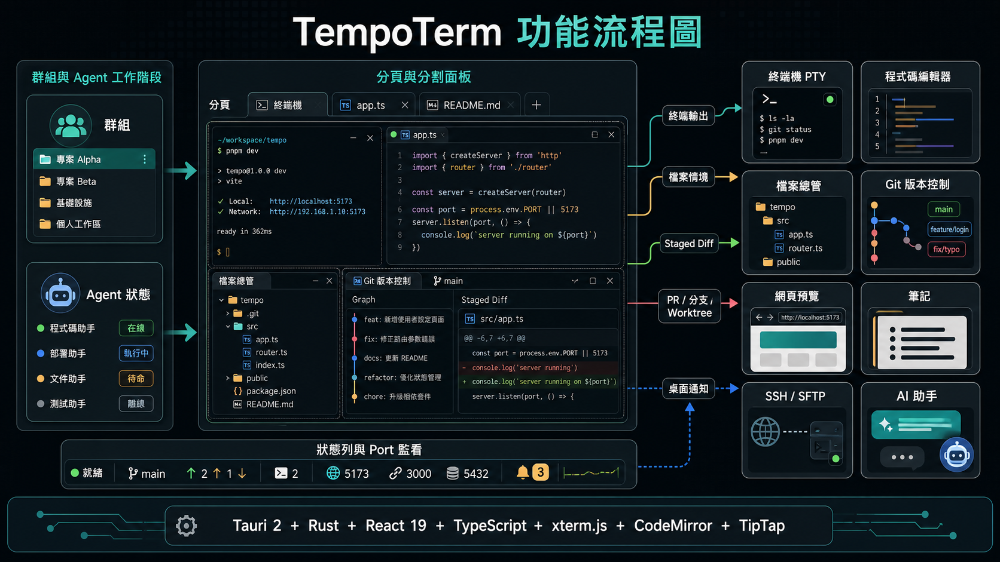

<div align="center">


# TempoTerm



一個 AI 原生的終端機工作區，把終端機、程式碼編輯器、檔案總管、Git 與 AI 助手整合在同一個視窗，並提供完整的正體中文支援

[English](./README.md) · **正體中文** · [简体中文](./README.zh-Hans.md)

</div>

TempoTerm 是一個用 Tauri 2 加 Rust 與 React 19 打造的桌面 app，把原生 PTY 終端機、程式碼編輯器、檔案總管、版本控制、網頁預覽、筆記、SSH／SFTP 遠端連線與自帶金鑰的 AI 助手放在一起，並提供完整的正體中文介面與對正體中文友善的終端機字體；也把工作整理成具名的群組，每個分頁的卡片即時追蹤對應 Claude 或 Codex CLI 工作階段的狀態，以及 Git 分支、worktree 與對應的 PR；還能把同一個 repo 的多個 worktree 並排跑，各自有獨立目錄與自己的 agent

<div align="center">


</div>


## 重點特色

- **AI agent 指揮中心**：每個分頁的卡片即時追蹤 Claude Code 或 Codex CLI 工作階段的狀態、Git 分支、worktree 與 PR，分割面板各自列出自己的 agent，需要批准時跳桌面通知
- **在 diff 上留評論給 agent**：對 diff 的任何一行留評論，一鍵打包送進正在執行的 agent 工作階段
- **並行 worktree**：同一個 repo 開多個 worktree 並行，各自的目錄跑各自的 agent
- **AI 對話瀏覽**：集中瀏覽 Claude Code、Codex 與 Antigravity 的所有歷史對話，附活動儀表板與成本估算
- **單一視窗工作區**：終端機、編輯器、檔案總管、版本控制、筆記、SSH／SFTP、網頁預覽與圖片／PDF 預覽，全部可自由分割並排
- **自帶金鑰的 AI 助手**：OpenAI、Anthropic、Google Gemini、Groq、DeepSeek、Ollama 與任何相容 OpenAI 的端點，金鑰加密並綁定本機
- **正體中文一等公民**：完整中文介面，加上讓全形字元對齊的終端機字體設定

## 功能

### AI 工作流

- 側邊欄以具名群組整理分頁；每張卡片顯示可篩選的工作階段狀態（執行中、思考中、等待輸入、等待批准）、分支、worktree 與對應 PR，分割的分頁列出每個面板自己的 agent，卡片標題自動從對話記錄推導
- agent 需要批准或在背景執行完畢時跳桌面通知；啟動器可直接開 Claude Code 或 Codex CLI 並帶預設參數
- 在 diff 的任何一行點行號旁的 + 留評論，一鍵把所有評論（按檔案分組、附行號與程式碼）貼進正在執行 Claude 或 Codex 的終端機面板，內容先落在輸入框、由你確認送出
- 從終端機選單或 git 提交圖建立 worktree，可複製 `.env` 這類本機檔案、執行記住的設定指令並直接啟動 agent；狀態列徽章打開管理器，列出每個 worktree 的分支、未提交改動、agent 活動與磁碟用量
- AI 對話瀏覽直接讀取各 CLI 的本機檔案（不複製進 TempoTerm），提供活動熱圖、model 用量、專案統計、成本估算，以及 Markdown 與 CSV 匯出
- AI 助手面板自帶金鑰即可用，可從檔案總管附加檔案當情境，終端機輸出預設納入且送出前先遮蔽機密資訊


### 終端機與工作區

- 以原生 PTY 驅動的 xterm.js v6：終端機內搜尋、zsh 指令自動建議、IP 與壓縮檔的 hover 動作卡片，Unicode 字寬表讓全形中文字維持對齊
- 任何面板都能四種方式分割：單擊側欄項目自動分割、拖檔案到面板、右鍵選單、拖到分頁列開新分頁
- CodeMirror 6 編輯器：AI ghost-text 補全（Tab 接受）、Markdown 編輯／並排／預覽三模式、檔案在磁碟上被改動時自動重新載入
- 檔案樹支援模糊搜尋與內容 grep，和終端機雙向同步目錄；點圖片或 PDF 直接在面板內預覽
- HTML 檔一鍵開原生網頁預覽（不是 iframe，不受反嵌入規則限制），存檔就會更新
- 終端機與編輯器標題列是可點擊的麵包屑路徑；側欄面板可拖到視窗左右任一側停靠

| **單擊自動分割**<br>單擊檔案總管或筆記裡的項目，直接分割進目前分頁<br> | **拖曳到面板**<br>把檔案或筆記拖到任一面板，依放開位置決定分割方向<br> |
| --- | --- |
| **右鍵選單**<br>右鍵選擇在新分頁開啟，或分割成新面板<br> | **拖曳到分頁列**<br>把檔案、筆記或 SSH 連線拖到分頁列，直接開新分頁<br> |

### 其他

- 版本控制：依資料夾分組的暫存、提交、推送，用 AI 從 staged diff 產生 Conventional Commits 訊息，提交圖點任一 commit 看變更與 diff，也能請 AI 解釋
- SSH：連線面板記住連線資訊與金鑰密碼，本機埠轉發，連線開著時在檔案總管用 SFTP 瀏覽與編輯遠端檔案
- 筆記：所見即所得編輯器、斜線指令選單、程式碼區塊可一鍵在終端機執行
- 狀態列：即時 CPU、記憶體與網路流量，連接埠面板列出每個 port 佔用的程式並可直接處理
- 多視窗，各自獨立的分頁、群組與對話狀態
- 多套深色與淺色主題，正體中文與英文介面可即時切換


## 技術堆疊

Tauri 2、Rust、portable-pty、git2、keyring、russh、React 19、TypeScript、Vite、Zustand、Tailwind CSS v4、xterm.js v6、CodeMirror 6、TipTap、i18next

## 開發

```bash
pnpm install        # 安裝前端依賴
pnpm tauri dev      # 以開發模式啟動桌面 app
pnpm typecheck      # TypeScript 型別檢查
pnpm build          # 建置前端
```

## 測試

```bash
pnpm test                       # 前端單元與整合測試（Vitest）
cd src-tauri && cargo test      # 後端 Rust 測試
```

## 贊助支持

如果 TempoTerm 幫你省下了時間，歡迎小額贊助，支持專案持續開發

<div align="center">

<a href="https://portaly.cc/mukiwu/support">
  
</a>

</div>
